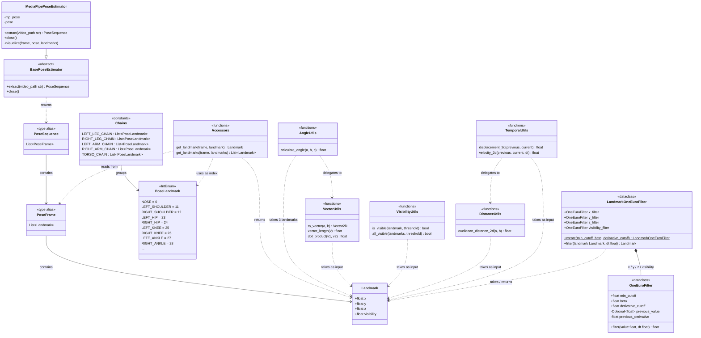
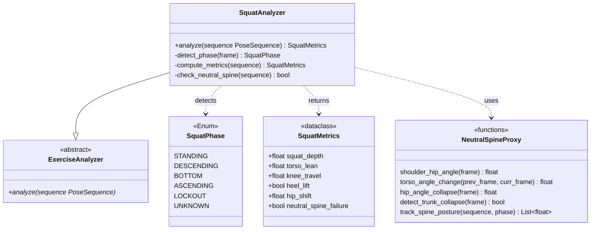

# Class Diagram — Engine

> Last updated: 2026-05-26
> ✅ Implemented | ⏳ Planned (not yet implemented)

---

## Implemented (E1 + E2)



---

## Planned — E3: Squat Movement Analysis ⏳



---

## Layer Overview

```
VIDEO
  │
  ▼
┌─────────────────────────────┐
│  LAYER 2 — Pose Estimation  │  MediaPipePoseEstimator
│  video → PoseSequence        │  (extracts raw landmarks)
└─────────────────────────────┘
  │  PoseSequence
  ▼
┌─────────────────────────────┐
│  LAYER 3 — Pose Semantics   │  PoseLandmark, Accessors, Chains
│  index → named landmark      │  (gives landmarks human-readable names)
└─────────────────────────────┘
  │  Landmark (by name)
  ▼
┌─────────────────────────────┐
│  LAYER 4 — Biomechanics     │  vectors, angles, visibility,
│  landmark → measurement      │  smoothing, distance, temporal
└─────────────────────────────┘
  │  angles, velocity, displacement
  ▼
┌─────────────────────────────┐  ⏳ planned
│  LAYER 5 — Squat Analysis   │  SquatAnalyzer, SquatPhase,
│  measurement → insight       │  SquatMetrics, NeutralSpineProxy
└─────────────────────────────┘
```

---

## Data Flow Examples

**"What is the knee angle?"**
```
PoseSequence[frame_n]
    → get_landmark(frame, PoseLandmark.LEFT_HIP)      → Landmark
    → get_landmark(frame, PoseLandmark.LEFT_KNEE)     → Landmark
    → get_landmark(frame, PoseLandmark.LEFT_ANKLE)    → Landmark
    → calculate_angle(hip, knee, ankle)               → float (degrees)
```

**"How fast is the hip moving?"**
```
PoseSequence[frame_n-1], PoseSequence[frame_n]
    → get_landmark(prev_frame, PoseLandmark.LEFT_HIP) → Landmark
    → get_landmark(curr_frame, PoseLandmark.LEFT_HIP) → Landmark
    → velocity_2d(prev_hip, curr_hip, dt)             → float (units/sec)
```

**"Is the spine neutral at the bottom?" (planned)**
```
PoseSequence (descending → bottom phase)
    → NeutralSpineProxy.shoulder_hip_angle(frame)     → float
    → NeutralSpineProxy.torso_angle_change(...)       → float
    → NeutralSpineProxy.detect_trunk_collapse(frame)  → bool
    → SquatMetrics.neutral_spine_failure              → bool
```
